# Fishes API

##### repo link
##### https://github.com/sdmantha/fishes-api.git/fishes
##### fishes api link
##### https://www.fishwatch.gov/developers
#### railway link
#### https://fishes-api-production.up.railway.app/fishes
 ---
 I built a JSON API using Mongoose and Express. Additionally, found a dataset online, pull data from it, and use this retrieved data to build my own model and seed my database.
 
 <!-- 
 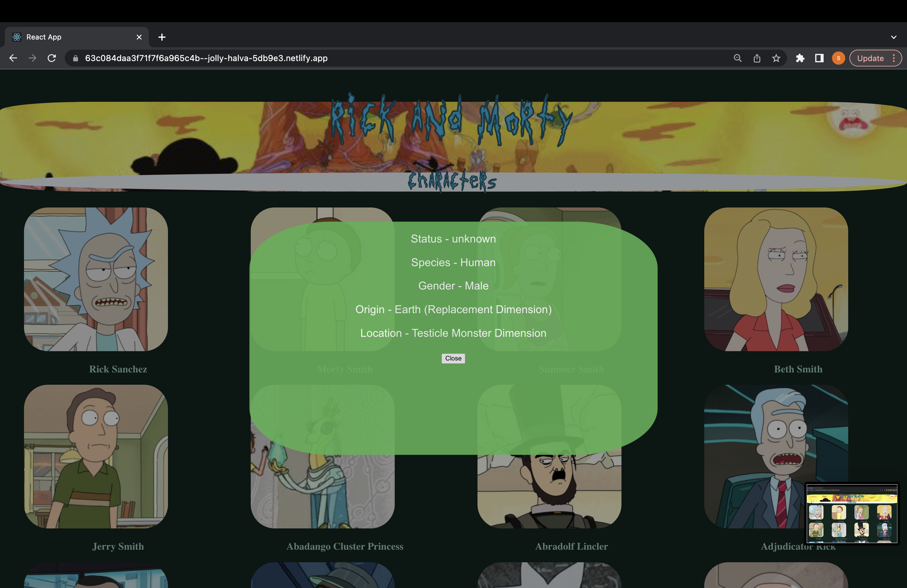 -->
 ---

### Technical Requirements

•Must be built using Express and Mongoose.

•Have at least one model.

•Have complete CRUD functionality implemented with RESTful routes. 

•Have its own repository under your GitHub account.

•Have well-documented API routes in your README file.

----
#### Steps

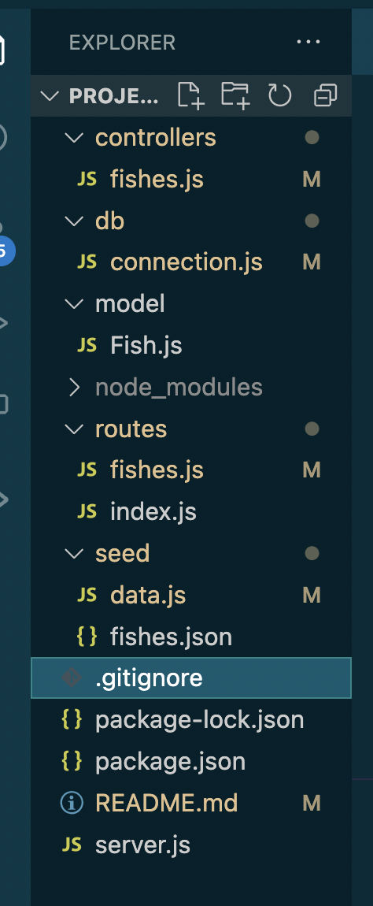

• Create a New folder and download the following

    •In terminal 
        npm i --save-dev nodemon (to locally download nodemon, which helps with monitoring your project directory and automatically restarts your node application when it detects any changes  )
        •npm install node-fetch (lets you grab the information from a the urls json and creates the json file for you when you create the function in a fetch.js file in the seed folder)
        •npm init -y ( this downloads a package.json, the -y says yes to all the questions and fills in the information automatically
        •touch .gitignore (to ignore untracked files)
        • in the .gitignore file add node_modules
           and .DS_Store
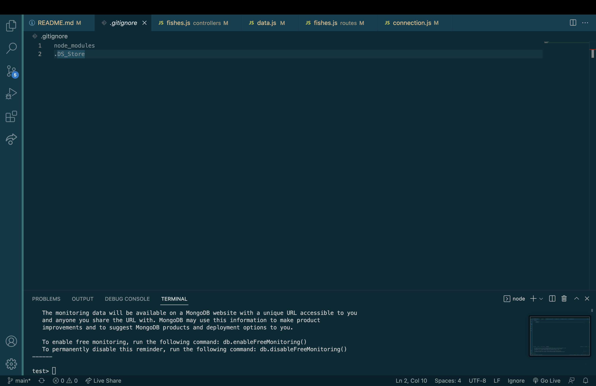

        •Back at terminal 
        •Npm i express mongoose chalk cors morgan (when written like this you are downloading all five applications in one go)
            •We will also use import to move our files so in the package.json you need to add 
                •"type": "modules"
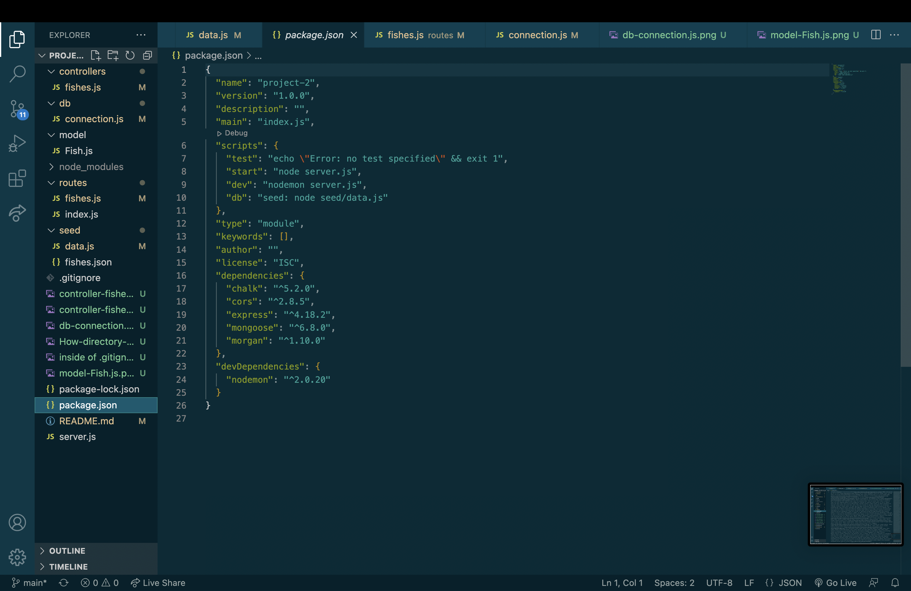

            •Chalk allows console.log messages some flavor
            •Morgan has their own type of logger
            •Cors allows us to connect to the backend to the front end
        •Mkdir controllers db model routes seed
            •create these folders in the main directory
                •The controllers folder holds the information and the function to do CRUD commands (Create, Read, Update, Delete which we will us postman to do the RUD commands)
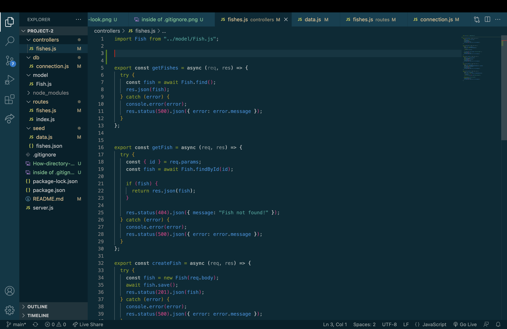
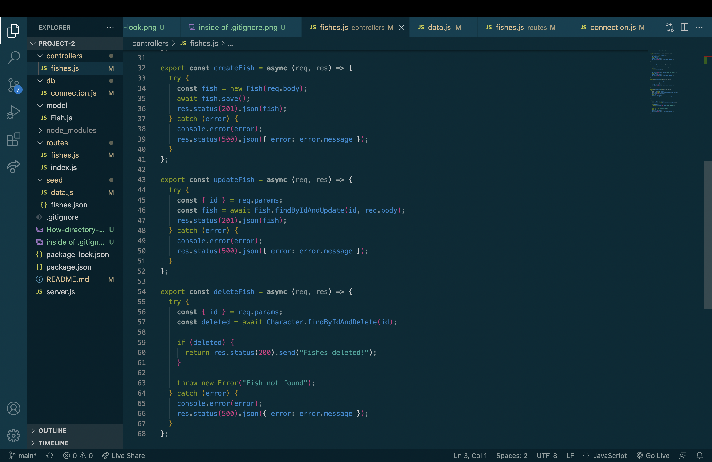

                •The db folder will have a connection.js file in it and it sets up your mongoose connection, which mongoose helps connect mongodb and javascript
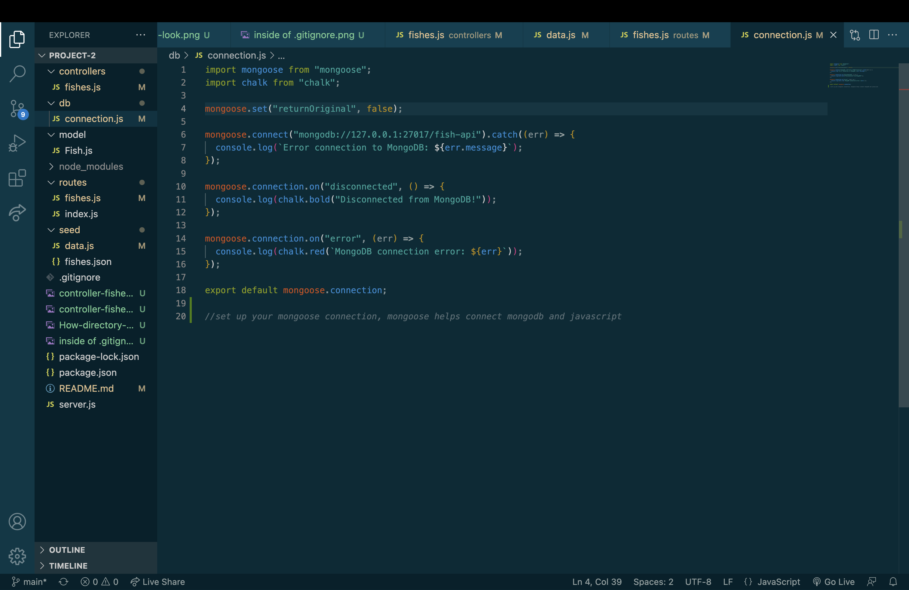

                •The routes folder is created so you can create routes with the fish.js file in the model folder, and contain the index.js file to create the route to the local host
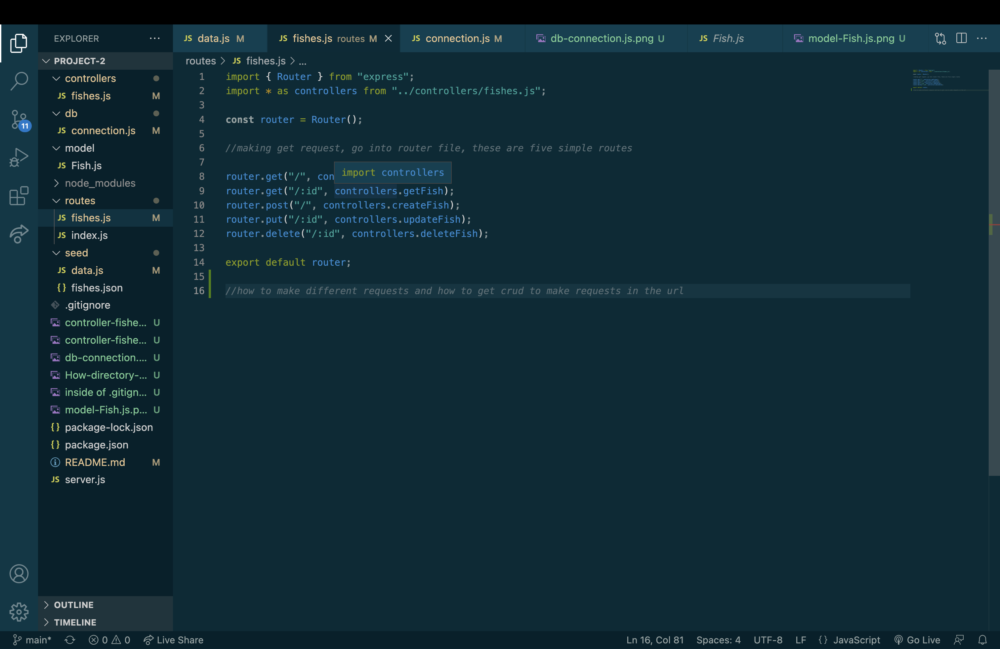
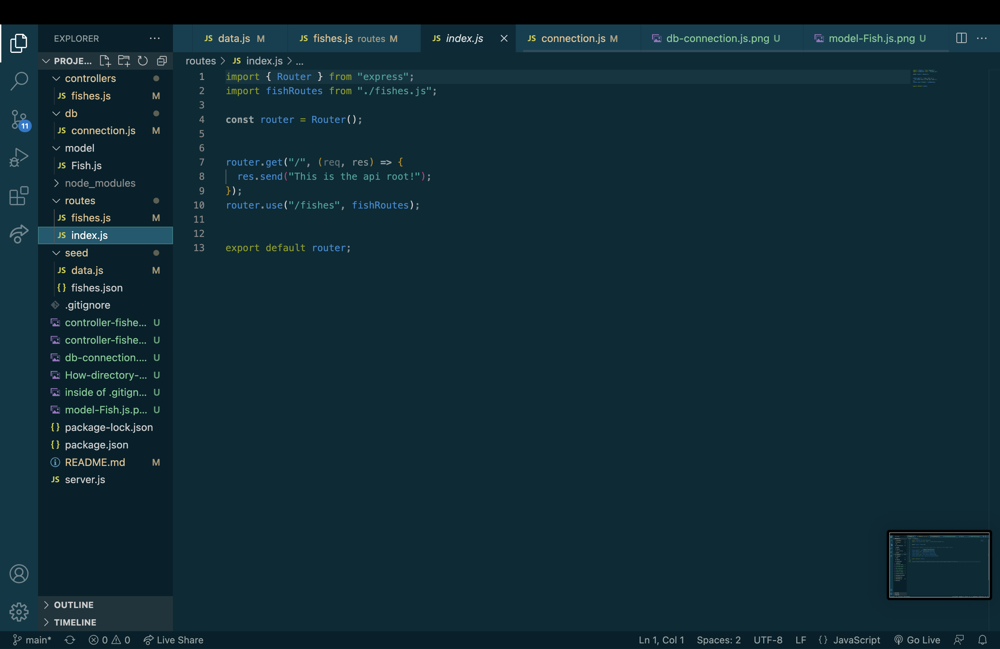

                •The seed folder will hold data.js fishes.json and a fetch.js. The data.js will put the information you want will grabbing it from the json information into the database, in mongodb. The fetch.js file will create the the fishes.json with the function that is created.
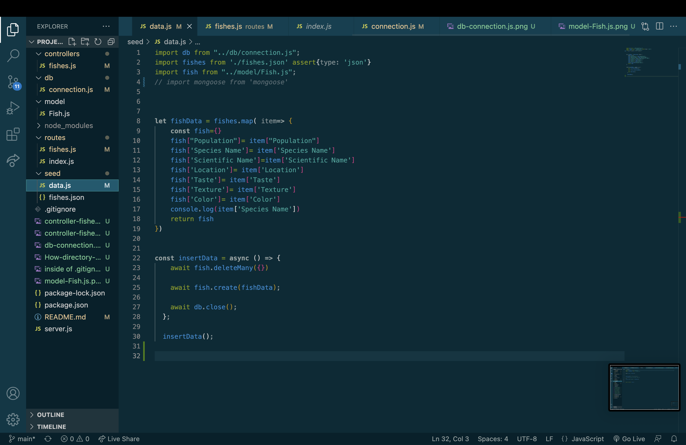
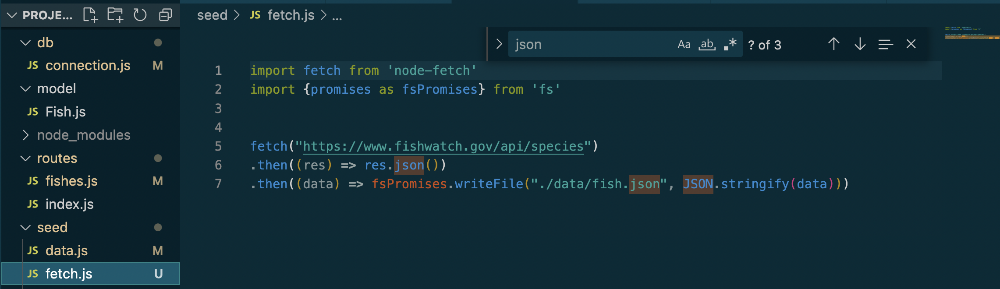

        •Make a server.js file in the main directory
            •This will hold the function to actually post the information you want onto the online platform in a local host that you create
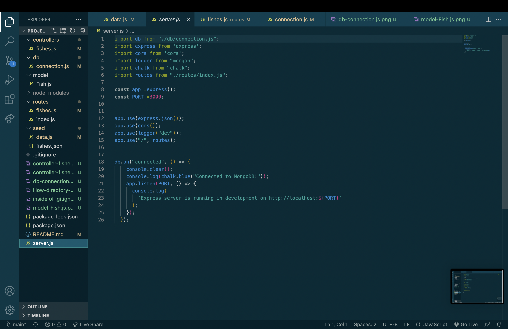
---
#### Problems to avoid

•Make sure you run node on the server.js and index.js to make sure your connection is working and everything is loading.

•Make sure in your routes you have the correct way of writing and making sure you have the ' /:id ' and ' / ' in the correct way

•A problem that I ran into was when I was creating my schema in model/Fishes.js and making sure the property name in the schema is written correctly and also in the data.js. Just because the words need to be written just how its written in the json file.

•We can create certain shortcuts in the package.json file in the "styles" section. Make sure you add it outside of a list (how it would look)

    "scripts": {
        "start": "node server.js",
        "dev": "nodemon server.js",
        "db": "seed: node seed/data.js"
        }

•Make sure your work is actually connecting to mongodb by typing mongosh in the terminal and looking in your databases

    show dbs (shows all the databases)

    use fish-api (or whatever your database is called, the left side where you're typing will show the name

    show collections (and in the project there is only one collection that I have named fishes)

    db.fishes.find() (typing this will show all the files that is in collection os fishes, some databases will have multiple collections and you can go into any of them by " db.whateverCollectionName.find() ")

---

    

